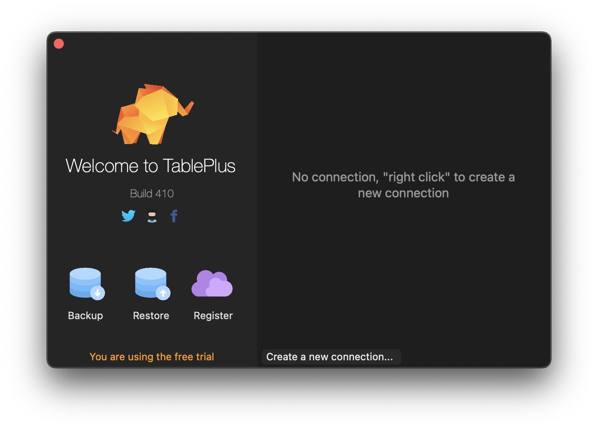
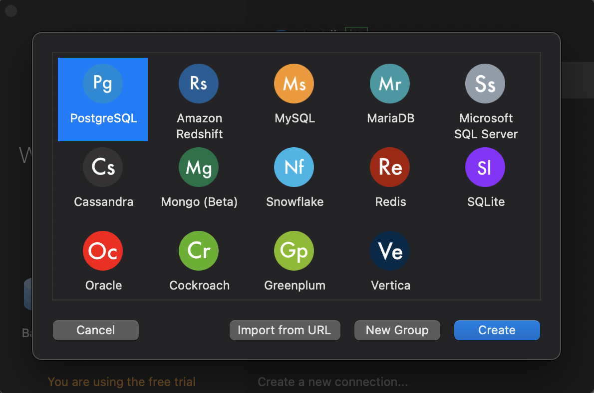
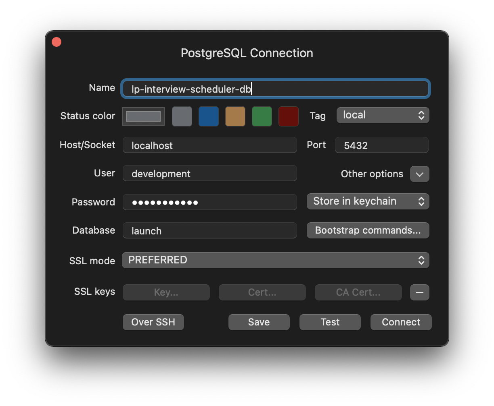

# lp-interview-scheduler backend

### Installing Dependencies

```
$ npm install
```

Please ensure you have [docker](https://docs.docker.com/get-docker/) installed on your local machine

### Starting a Development Server

```
$ npm run serve
```

### Starting the Postgres database

There are a few commands in `package.json` to interact with the postgres database

#### Building the image and running the container for the first time

Before starting the database for the first time, we need to build the docker image from the `Dockerfile` in the `backend-server` directory

```
$ npm run build-db
```

After building the image for the first time, we need to run the following command to create the database container from the image. This command will also start the container too.

```
$ npm run run-db
```

#### Starting the database container

After you've set the database up once before, we can start the database up again using the following commmand. This command needs to be run everytime we spin up our local backend.

```
$ npm run start-db
```

#### Stopping the database container

Whenever you want to stop running the database, simply run the following

```
$ npm run stop-db
```

#### Removing all traces of the dockerized database

If at some point you want to nuke your database and/ or remove it entirely from your computer, you can run the following commands

##### Remove the container

```
$ npm run rm-db-container
```

##### Remove the image

```
$ npm run rm-db-image
```

### Seeing the data in the database

One tool you can use to see the data in the database and interact with it (add rows, tables, edit data) is [TablePlus](https://tableplus.com/download)

Ensure your database is up and running before trying to connect to it

To set up TablePlus, first open the application and click on 'Create a new connection'



Click on the PostgreSQL option



Enter the following connection credentials.

- Name: anything
- Host: localhost
- Port: 5432
- User: development
- Password: development
- Database: launch


